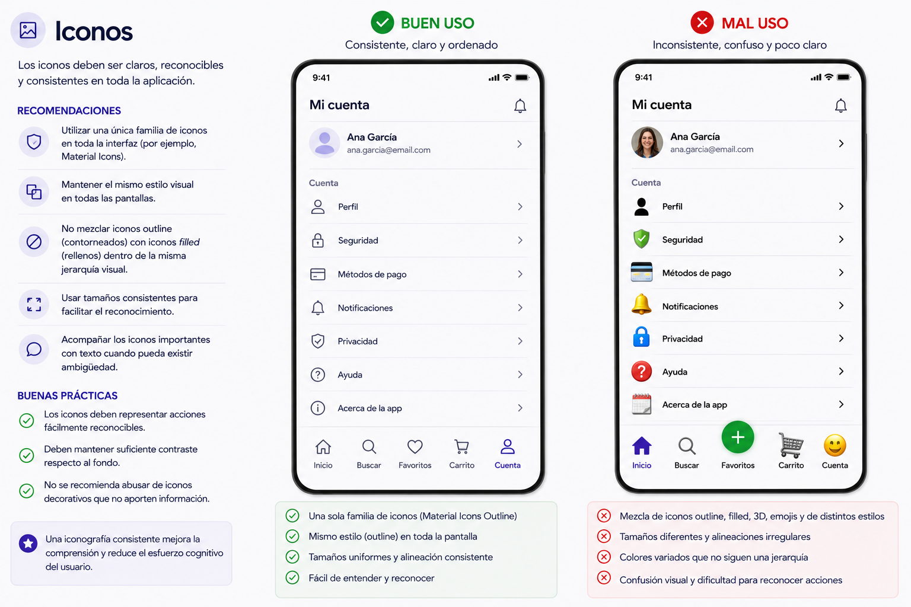

# 2. Accesibilidad y Usabilidad

## Criterios de evaluación del Resultado de aprendizaje

<div class="criterios">
  <div class="criterio"><p>Se han identificado los principales estándares de usabilidad y accesibilidad.</p></div>
  <div class="criterio"><p>Se han creado diferentes tipos de menús cuya estructura y contenido siguen los estándares establecidos.</p></div>
  <div class="criterio"><p>Se han distribuido las acciones en menús, barras de herramientas, botones de comando, entre otros, siguiendo un criterio coherente.</p></div>
  <div class="criterio"><p>Se han distribuido adecuadamente los controles en la interfaz de usuario.</p></div>
  <div class="criterio"><p>Se ha utilizado el tipo de control más apropiado en cada caso.</p></div>
  <div class="criterio"><p>Se ha diseñado el aspecto de la interfaz de usuario (colores y fuentes entre otros) atendiendo a su legibilidad.</p></div>
  <div class="criterio"><p>Se ha verificado que los mensajes generados por la aplicación son adecuados en extensión y claridad.</p></div>
  <div class="criterio"><p>Se han realizado pruebas para evaluar la usabilidad y accesibilidad de la aplicación.</p></div>
</div>

---

## 2.1 Usabilidad y Accesibilidad

Antes de diseñar cualquier interfaz es imprescindible conocer dos conceptos fundamentales que deben guiar cada decisión de diseño.

### Usabilidad

La **usabilidad** es la facilidad con la que un usuario puede utilizar una aplicación de forma intuitiva, sin necesidad de formación previa o de leer un manual.

Una aplicación usable:

- Se aprende rápido: el usuario entiende cómo funciona en los primeros segundos.
- Es eficiente: permite completar tareas con el menor número de pasos posible.
- Es fácil de recordar: si el usuario no la usa durante un tiempo, puede retomar su uso sin dificultad.
- Minimiza los errores: dificulta que el usuario cometa errores y, si ocurren, facilita su recuperación.
- Es satisfactoria: genera una experiencia agradable.

### Accesibilidad

La **accesibilidad** engloba el conjunto de características de diseño que permiten que **cualquier persona**, independientemente de sus capacidades físicas, cognitivas o sensoriales, pueda utilizar nuestra aplicación.

Aspectos clave de la accesibilidad:

| Aspecto | Descripción |
|--------|-------------|
| **Tipografía** | Tamaño de letra legible, suficiente contraste entre texto y fondo. |
| **Color** | No usar el color como único medio de transmitir información. |
| **Tamaños táctiles** | Los elementos interactivos deben ser suficientemente grandes para pulsarse con precisión. |
| **Lectores de pantalla** | Los elementos deben tener etiquetas descriptivas para personas con discapacidad visual. |
| **Contraste** | El contraste entre el texto y su fondo debe superar una ratio mínima para garantizar la legibilidad. |

!!! info "Recuerda"
    Diseñar con accesibilidad no solo beneficia a personas con discapacidad. Una interfaz accesible es, en general, más clara y más fácil de usar para todo el mundo.

---

## 2.2 Tipos de menús y patrones de navegación

En aplicaciones móviles, la navegación es uno de los elementos más críticos del diseño. El usuario debe saber en todo momento **dónde está** y **cómo llegar** a donde quiere ir.

### Bottom Navigation Bar (Barra de navegación inferior)

Es el patrón más habitual en apps móviles. Se sitúa en la parte inferior de la pantalla y permite acceder a las secciones principales de la aplicación de un solo toque.

**Cuándo usarla:**

- Cuando la app tiene entre **2 y 5 secciones principales**.
- Cuando el usuario necesita cambiar de sección con frecuencia.

**Reglas de diseño:**

- Mostrar siempre la sección activa con un color o icono diferenciado.
- Usar iconos acompañados de etiqueta de texto corta.
- No superar 5 elementos: si hay más, utilizar un menú adicional.

```
[ 🏠 Inicio ] [ 🔍 Buscar ] [ ❤️ Favoritos ] [ 👤 Perfil ]
```

### Drawer (Menú lateral deslizante)

Panel que se desliza desde el lado izquierdo de la pantalla. Suele activarse pulsando el icono de "hamburgesa" (☰) o con un gesto de deslizamiento lateral.

**Cuándo usarlo:**

- Cuando la aplicación tiene **muchas secciones** que no caben en la barra inferior.
- Para opciones secundarias o de configuración que no se usan con frecuencia.

**Reglas de diseño:**

- El contenido principal no debe quedar bloqueado por el drawer.
- Incluir el nombre o avatar del usuario en la cabecera si la app tiene sesión iniciada.

### Tab Bar (Pestañas)

Pestañas situadas en la parte superior o inferior que permiten cambiar entre vistas relacionadas de un mismo apartado.

**Cuándo usarlas:**

- Para dividir el **contenido de una misma sección** en categorías (ej.: "Todos", "Pendientes", "Completados").
- No mezclar con la Bottom Navigation Bar para la navegación principal.

### Floating Action Button (FAB)

Botón circular flotante que representa la **acción principal** de la pantalla actual.

**Cuándo usarlo:**

- Para la acción más importante y frecuente de esa pantalla (crear, añadir, escanear...).
- Solo debe haber **un FAB por pantalla**.

**Reglas de diseño:**

- Tamaño estándar: 56×56 píxeles.
- Situarlo en la esquina inferior derecha, sin bloquear el contenido.
- Usar un icono claro que represente la acción.

---

## 2.3 Distribución de acciones: botones y controles de acción

Agrupar y dimensionar correctamente los elementos interactivos es clave para una interfaz coherente y usable.

### Tamaño mínimo de los elementos táctiles

Según las guías de **Material Design** (Google), todo elemento con el que el usuario pueda interactuar debe tener un área táctil mínima de **48×48 píxeles** para garantizar que pueda pulsarse con precisión, aunque visualmente sea más pequeño.


### Tipos de botones

Material Design define tres niveles de jerarquía para los botones según su importancia:

| Tipo | Aspecto | Uso |
|------|---------|-----|
| **Filled (relleno)** | Fondo de color sólido | Acción principal de la pantalla |
| **Outlined (contorneado)** | Solo borde | Acciones secundarias |
| **Text** | Solo texto | Acciones terciarias o de bajo énfasis |


### Bordes redondeados

El **radio de borde** (border radius) ayuda a definir el estilo visual y la personalidad de la interfaz.

- **4–8 px**: apariencia más rígida y tradicional.
- **12–16 px**: equilibrio ideal entre modernidad, claridad y profesionalidad. Es el valor recomendado para la mayoría de interfaces móviles.
- **Radio completo (pill)**: utilizado en chips, etiquetas, barras de búsqueda y algunos botones destacados.

En aplicaciones móviles modernas se recomienda utilizar **12–16 px** como radio base y mantenerlo de forma consistente en botones, tarjetas, campos de texto y otros componentes interactivos.

La consistencia en el redondeado mejora:

- la percepción visual de orden,
- la coherencia del sistema de diseño,
- y la sensación de calidad de la aplicación.


### Elevación y sombras

La **elevación** (elevation) permite crear jerarquía visual dentro de la interfaz mediante sombras y profundidad.

Los elementos con mayor elevación parecen estar "más cerca" del usuario y captan antes la atención.

**¿Cuándo utilizar sombras?**

Las sombras se utilizan principalmente para:

- destacar acciones importantes,
- separar elementos del fondo,
- indicar componentes interactivos,
- y reforzar la sensación de profundidad.

**Uso habitual en interfaces móviles**

- **Botones flotantes (FAB)**: utilizan sombras más pronunciadas para destacar como acción principal.
- **Tarjetas (cards)**: suelen tener una elevación media para separarse visualmente del fondo.
- **Modales y diálogos**: emplean una elevación alta para indicar que están por encima del contenido principal.
- **Botones principales**: pueden incorporar una sombra suave para aumentar su visibilidad.

**Recomendaciones**

- Utilizar sombras sutiles y consistentes.
- Evitar sombras excesivamente oscuras o difusas.
- Mantener el mismo sistema de elevación en toda la aplicación.

En interfaces modernas, una sombra ligera suele ser suficiente para transmitir profundidad sin sobrecargar el diseño.


!!! tip "Regla de oro"
    No mezclar estilos de botón dentro de una misma pantalla. Define un estilo para acción principal y otro para acción secundaria, y aplícalo de forma coherente en toda la app.

---

## 2.4 Distribución de controles en la interfaz

Una buena distribución de los elementos hace que la interfaz sea más cómoda de usar y visualmente más atractiva. Los elementos necesitan "respirar".

### Márgenes y padding

Para eliminar una sensación de "agobio" o apelotonamiento de los elementos en las pantallas, se recomienda el uso de paddings y márgenes.

| Elemento | Valor recomendado |
|----------|-------------------|
| Margen lateral de la pantalla | **16 px** |
| Espaciado entre icono y texto | **8 px** |
| Espaciado entre elementos relacionados | **8 px** |
| Espaciado entre bloques o secciones | **16–24 px** |
| Padding interno de tarjetas (cards) | **16 px** |
| Padding interno de botones | **12–16 px** |
| Separación entre campos de formulario | **16 px** |
| Espaciado entre título y contenido | **8–12 px** |
| Altura mínima de un ítem de lista | **48 px** |
| Separación respecto a bordes de modales/dialogs | **24 px** |
| Área segura inferior/superior (safe area) | **16 px mínimo** |


### Posición del texto

- El texto debe tener siempre suficiente padding respecto al borde del contenedor: mínimo **16 px** a los lados.
- Alinear el texto a la izquierda en la mayoría de los casos. El texto centrado solo debe usarse para títulos cortos o mensajes de estado.

### Espaciado coherente

Un espaciado coherente transmite orden y profesionalidad. Para lograrlo:

1. Decidir una unidad base de espaciado (ej.: 8 px) y usarla como múltiplo para todos los márgenes y paddings.
2. No mezclar valores arbitrarios (ej.: no usar 7 px, 11 px, 13 px...).
3. Agrupar visualmente los elementos relacionados acercándolos; separar los no relacionados con más espacio.

---

## 2.5 El control adecuado para cada situación

Elegir el control correcto facilita la comprensión inmediata de la interfaz por parte del usuario.

| Control | Cuándo usarlo | Ejemplo de uso |
|---------|---------------|----------------|
| **Button** | Ejecutar una acción puntual | "Guardar", "Enviar", "Eliminar" |
| **Checkbox** | Selección múltiple de opciones independientes | Seleccionar varios elementos de una lista |
| **Switch** | Activar o desactivar una función (estado binario) | "Activar notificaciones", "Modo oscuro" |
| **TextField (Texto)** | Introducir texto libre | Nombre, correo, contraseña, búsqueda |

### Diferencias clave entre Checkbox y Switch

Aunque ambos representan un estado binario (activado/desactivado), su uso es diferente:

- **Checkbox**: se usa cuando hay varias opciones y el cambio **no tiene efecto inmediato** (se confirma con un botón "Guardar" o "Aplicar").
- **Switch**: se usa cuando el cambio **tiene efecto inmediato**, sin necesidad de confirmar. Si activas el Switch de "Notificaciones", el cambio se aplica al instante.

!!! warning "Error frecuente"
    No uses un Switch cuando el usuario necesite confirmar su elección. En ese caso, usa un Checkbox junto con un botón de confirmación.

---

## 2.6 Diseño visual: colores, fuentes e iconos

El aspecto visual de la interfaz no es solo estética: afecta directamente a la legibilidad y a la percepción de la aplicación.

### Jerarquía tipográfica

Utilizar **una sola tipografía** en toda la aplicación y diferenciar los niveles de texto mediante tamaño y peso (grosor), no mediante tipografías distintas.

Una jerarquía tipográfica consistente mejora la legibilidad y ayuda al usuario a identificar rápidamente la importancia de cada contenido.

| Nivel | Tamaño orientativo | Uso |
|-------|--------------------|-----|
| **Display / Hero** | 32-48 px | Títulos muy grandes, portadas |
| **Headline (H1)** | 24-32 px | Títulos de pantalla principal |
| **Title (H2)** | 18-22 px | Subtítulos de sección |
| **Body** | 14-16 px | Texto de contenido general |
| **Caption** | 11-12 px | Texto secundario, etiquetas, notas |


### Esquema de colores

Material Design organiza los colores según distintos roles dentro de la interfaz:

| Rol de color | Descripción | Uso habitual |
|-------------|-------------|--------------|
| **Primary** | Color principal de la marca | Botones principales, FAB, elementos destacados |
| **On Primary** | Color del contenido mostrado sobre el color primario | Texto e iconos sobre botones o fondos primarios |
| **Secondary** | Color de apoyo o acento | Chips, indicadores, elementos secundarios |
| **Background** | Color de fondo general de la aplicación | Fondo principal de las pantallas |
| **Surface** | Fondo de componentes elevados | Tarjetas, diálogos, menús, modales |
| **Error** | Color utilizado para errores y estados críticos | Mensajes de error, campos inválidos |

**Recomendaciones**

- Mantener una paleta reducida para evitar sobrecargar visualmente la interfaz.
- Utilizar el color principalmente para reforzar jerarquía e interacción.
- Garantizar suficiente contraste entre texto y fondo para asegurar la accesibilidad.


### Iconos

- Usar una **familia de iconos consistente** en toda la app (por ejemplo, Material Icons).
- No mezclar iconos de estilo outline (contorneados) con iconos filled (rellenos) en la misma pantalla.
- Los iconos deben ir **siempre acompañados de una etiqueta de texto** cuando su función no sea universalmente reconocible.



---

## 2.7 Mensajes de la aplicación

Los mensajes que la aplicación muestra al usuario (confirmaciones, errores, avisos...) deben ser **claros, concisos y coherentes** con el color que los representa.

### Tipos de mensaje y color asociado

| Tipo de mensaje | Color | Cuándo usarlo | Ejemplo de texto |
|-----------------|-------|---------------|------------------|
| **Éxito** | 🟢 Verde | Operación completada correctamente | "El registro se ha guardado correctamente." |
| **Error** | 🔴 Rojo | Acción fallida, dato incorrecto, eliminación | "No se ha podido guardar. Comprueba tu conexión." |
| **Aviso** | 🟡 Amarillo / Ámbar | Acción que requiere atención o puede tener consecuencias | "Esta acción eliminará todos los datos. ¿Deseas continuar?" |
| **Información** | 🔵 Azul | Mensajes neutros e informativos | "La sincronización se realizará al conectarse a WiFi." |

### Cómo redactar un buen mensaje

Un buen mensaje de aplicación debe:

1. **Describir exactamente lo que ha ocurrido**, sin tecnicismos.
2. **Indicar qué debe hacer el usuario** si se requiere alguna acción.
3. Ser **breve**: una o dos frases como máximo.
4. Usar un **lenguaje cercano y directo**, en segunda persona cuando sea posible.

!!! example "Ejemplo: mensaje de error"
     **Incorrecto:** "Error 403. Forbidden resource access."

     **Correcto:** "No tienes permiso para acceder a este contenido. Contacta con el administrador."

---

## 2.8 Pruebas de accesibilidad

Una vez diseñada la interfaz, es importante verificar que los colores elegidos cumplen los requisitos mínimos de contraste para garantizar la legibilidad.

### Coolors Contrast Checker

[**Coolors Contrast Checker**](https://coolors.co/contrast-checker) es una herramienta online que permite comprobar si la combinación de un color de texto y un color de fondo ofrece suficiente contraste para ser legible.

**Cómo usarla:**

1. Introduce el **color del texto** (en formato HEX, por ejemplo `#FFFFFF`).
2. Introduce el **color del fondo** (por ejemplo `#1565C0`).
3. La herramienta muestra la **ratio de contraste** y si supera los umbrales recomendados:

| Nivel | Ratio mínima | Aplicación |
|-------|-------------|------------|
| **AA (recomendado)** | 4.5:1 para texto normal / 3:1 para texto grande | Estándar mínimo para la mayoría de apps |
| **AAA (óptimo)** | 7:1 para texto normal | Máxima accesibilidad |

